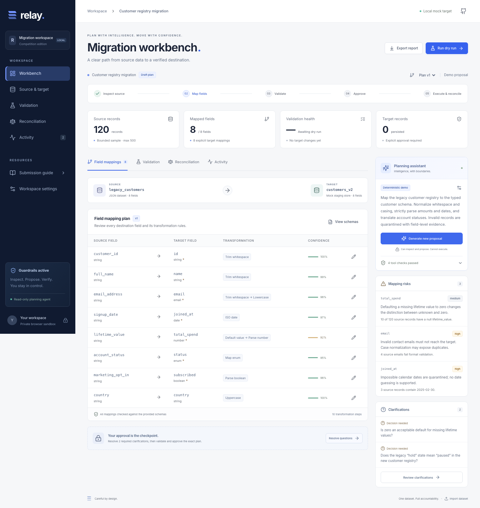
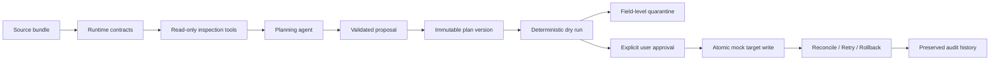

# Relay

**Plan with intelligence. Move with confidence.**

An agentic data migration planner and reconciliation workbench for one bounded dataset. Relay makes the decisions, evidence and recovery path visible: inspect schemas, review a proposed mapping, validate every record, explicitly approve, migrate, reconcile, retry safely and roll back.

[Deploy on Vercel](https://vercel.com/new/clone?repository-url=https%3A%2F%2Fgithub.com%2Ftohin003%2FAsync-Task&project-name=relay-migration-workbench&repository-name=relay-migration-workbench) · [Competition walkthrough](docs/SUBMISSION.md) · [Architecture](docs/ARCHITECTURE.md) · [Phased plan](docs/PLAN.md)



## Try the complete workflow

The application opens with a synthetic 120-record customer registry and an explicitly labeled deterministic demo proposal. No API key, database service or account is needed.

1. Inspect **Source & target**, then review the field mappings, risks and tool trace.
2. Select **Resolve questions**. Confirm the missing-spend default and legacy status interpretation. Your answers create a new immutable version.
3. Select **Run dry run**. The demo yields **120 transformed, 108 accepted and 12 quarantined**. Filter quarantined rows and open an inspection to see original values, transformed values, error codes and failed rules.
4. Select **Review & approve**, enter your reviewer name and attest to the exact plan. Approval alone does not execute anything.
5. Execute the approved migration, then retry: the first attempt inserts **108** rows; the second inserts **0** and skips **108**.
6. Run reconciliation, roll back the owned rows and inspect the preserved **Activity** trail. Export the workspace, target, quarantine or audit report.

**Your mock target is persistent IndexedDB storage in this browser and origin.** Each visitor has an isolated workspace. Refresh preserves it; clearing browser site data removes it. This is an intentional mock, not a shared production database.

## What is implemented

| Requirement                                                  | Implementation                                                                                            |
| ------------------------------------------------------------ | --------------------------------------------------------------------------------------------------------- |
| Propose mappings and supported transformations               | Optional live tool-calling agent and labeled deterministic demo planner                                   |
| Identify incompatibilities, missing fields and mapping risks | Schema checks, source profiles, explicit null mappings, risk evidence and clarification questions         |
| Approve before execution                                     | Reviewer attestation bound to exact plan and dry-run SHA-256 digests                                      |
| Version migration plans                                      | Immutable versions; edits and clarification decisions create a new version                                |
| Deterministic dry run                                        | Ordered finite transformations, strict target validation and stable content digest                        |
| Quarantine invalid records                                   | Full source/transformed values plus field, failed rule, error code and message                            |
| Source/transformed/accepted/rejected counts                  | Count cards, validation waterfall and per-record ledger                                                   |
| Approved mock migration                                      | Atomic target writes and execution history in one IndexedDB transaction                                   |
| Retry without duplicate insertion                            | Matching owned rows are skipped; conflicting keys/content abort all inserts                               |
| Compare source and target totals                             | Counts plus content-hash checks for missing, drifted and unexpected rows                                  |
| Rollback                                                     | Remove only the selected plan's owned rows and close its execution lineage                                |
| Preserve history                                             | Hash-chained dataset, version, validation, approval, execution, retry, reconciliation and rollback events |
| Bounded scope                                                | One active source, one mock target, 500 rows, 32 fields per schema, 1 MB per JSON bundle                  |

## Run locally

Use Node.js 24 (Node 22.12+ is also supported).

```bash
npm ci
npm run dev
```

Open [localhost:3000](http://localhost:3000).

```bash
npm run verify        # lint, strict types, unit/integration tests, production build
npx playwright install chromium
npm run test:e2e      # complete browser lifecycle, boundaries, mobile and accessibility
npm run format:check
npm audit
```

## Deploy to Vercel

Import **tohin003/Async-Task** into Vercel, select **Next.js**, use the repository root and Node.js 24. The standard `npm run build` command is sufficient. The demo works with **no environment variables**. Deployment uses no server filesystem or production database.

To enable the real AI planner, configure server-only variables before redeploying:

| Variable               | Purpose                                                                                   |
| ---------------------- | ----------------------------------------------------------------------------------------- |
| `OPENAI_API_KEY`       | Enable live OpenAI planning                                                               |
| `OPENAI_MODEL`         | Responses-compatible tool-calling model; default `gpt-4.1-mini`                           |
| `PLANNER_ACCESS_TOKEN` | Optional bearer secret restricting paid live requests; recommended for public deployments |

Select **Workspace settings → Live OpenAI agent** after deployment. If access protection is configured, enter its token in the app; the token is held only in memory. Source records are never sent to the planner. Live calls send schema definitions and aggregate field profiles, so avoid confidential information in schema descriptions. Provider errors are surfaced explicitly and never silently relabeled as demo results.

See [deployment details](docs/DEPLOYMENT.md). Live provider contracts and the tool loop are tested with controlled responses; an actual paid model call requires your configured key.

## Bring your own dataset

Select **Import dataset**, download the example bundle, replace its schemas and records, and upload it. The input is a single JSON object:

```json
{
  "name": "Example migration",
  "sourceSchema": {
    "name": "legacy",
    "primaryKey": "id",
    "fields": [{ "name": "id", "type": "string", "required": true }]
  },
  "targetSchema": {
    "name": "target",
    "primaryKey": "id",
    "fields": [{ "name": "id", "type": "string", "required": true }]
  },
  "records": [{ "id": "record-1" }]
}
```

Field types: `string`, `number`, `integer`, `boolean`, `date`, `email`, `enum`. Constraints include `required`, `unique`, `min`, `max`, and enum `values`. A primary key must be a required string or integer. Records contain flat JSON scalar values only. Roll back active target rows before replacing the dataset; old versions and their source snapshots remain inspectable. A workspace supports 50 plan versions.

Supported rules: `trim`, `lowercase`, `uppercase`, `to_number`, `to_integer`, `to_boolean`, `date_iso`, `enum_map`, `default`, `multiply`. Arguments are finite JSON scalars, bounded enum lookup objects or numeric factors. No arbitrary code is accepted. Dates require valid `YYYY-MM-DD`; fractions are never truncated into integers; consent is never inferred. Numbers use JavaScript's finite IEEE-754 representation; this mock is not a financial decimal accounting engine.

## Agent reliability and AgentGuard

The supplied AgentGuard was inspected and its actual repository index was run during development. It is a Python coding-agent guard with a Claude Code adapter, not an LLM or a browser/Vercel SDK. Relay's runtime policies are original TypeScript guards inspired by its evidence-first approach; this project does not claim to bundle or run its daemon in the application.

An optional read-only integration is included:

```bash
# Use a Python >=3.12 environment with AgentGuard's dependencies installed.
AGENTGUARD_SOURCE=/path/to/AgentGuard npm run guard:inspect
```

The adapter invokes `RepoIndex` directly without installing hooks or changing global configuration. TypeScript symbol evidence is unknown unless AgentGuard's optional language extractor is installed. See [verification evidence](docs/RELEASE.md).

## Trust boundaries



The agent has four tools: `inspect_schemas`, `profile_source`, `inspect_transformations`, `validate_proposal`. It has no approval or target-write capability. The live loop is limited to 7 rounds, 12 calls and 45 seconds. Both live and demo proposals pass schema and semantic validation. Execution recomputes the deterministic result and verifies approval before writing.

Reviewer names are local attestations, not authenticated enterprise identities. Hash chaining detects accidental history damage; a user who controls browser storage can alter it. The scope excludes production database access, arbitrary transformation code, distributed migration and live cloud connectors.

## Stack

Next.js App Router · React · TypeScript · Zod · IndexedDB · SHA-256 · self-hosted Inter · Lucide · Vitest · Playwright · axe-core · GitHub Actions.

All demonstration records are synthetic.
